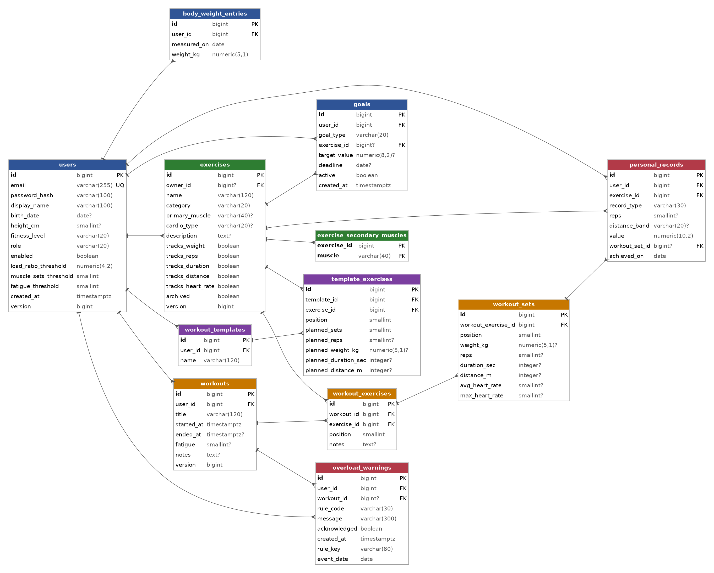
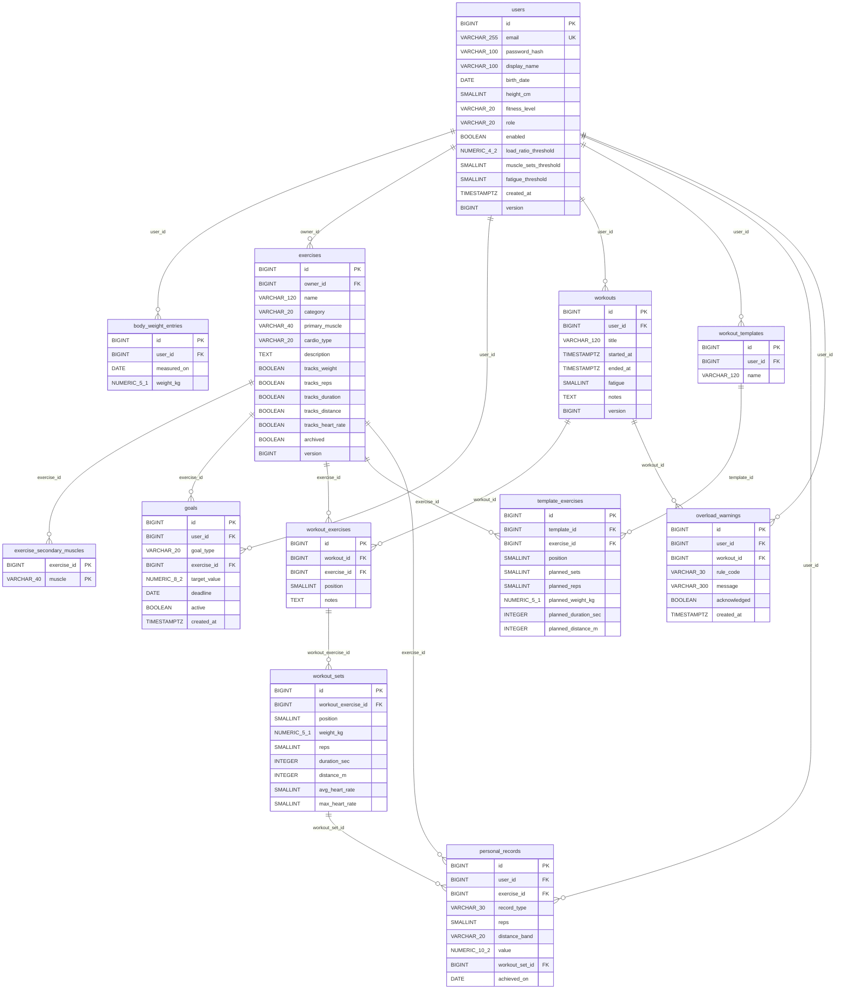

# RepTrack ER-diagram

A Flyway migrációkból generálva (`python3 docs/generate-er.py`). Jelmagyarázat: PK = elsődleges kulcs, FK = idegen kulcs, UQ/UK = egyedi; `?` a PNG-ben: nullázható.

```mermaid
erDiagram
    users {
        BIGINT id PK
        VARCHAR_255 email UK
        VARCHAR_100 password_hash
        VARCHAR_100 display_name
        DATE birth_date
        SMALLINT height_cm
        VARCHAR_20 fitness_level
        VARCHAR_20 role
        BOOLEAN enabled
        NUMERIC_4_2 load_ratio_threshold
        SMALLINT muscle_sets_threshold
        SMALLINT fatigue_threshold
        TIMESTAMPTZ created_at
        BIGINT version
    }
    body_weight_entries {
        BIGINT id PK
        BIGINT user_id FK
        DATE measured_on
        NUMERIC_5_1 weight_kg
    }
    exercises {
        BIGINT id PK
        BIGINT owner_id FK
        VARCHAR_120 name
        VARCHAR_20 category
        VARCHAR_40 primary_muscle
        VARCHAR_20 cardio_type
        TEXT description
        BOOLEAN tracks_weight
        BOOLEAN tracks_reps
        BOOLEAN tracks_duration
        BOOLEAN tracks_distance
        BOOLEAN tracks_heart_rate
        BOOLEAN archived
        BIGINT version
    }
    exercise_secondary_muscles {
        BIGINT exercise_id PK
        VARCHAR_40 muscle PK
    }
    goals {
        BIGINT id PK
        BIGINT user_id FK
        VARCHAR_20 goal_type
        BIGINT exercise_id FK
        NUMERIC_8_2 target_value
        DATE deadline
        BOOLEAN active
        TIMESTAMPTZ created_at
    }
    workouts {
        BIGINT id PK
        BIGINT user_id FK
        VARCHAR_120 title
        TIMESTAMPTZ started_at
        TIMESTAMPTZ ended_at
        SMALLINT fatigue
        TEXT notes
        BIGINT version
    }
    workout_exercises {
        BIGINT id PK
        BIGINT workout_id FK
        BIGINT exercise_id FK
        SMALLINT position
        TEXT notes
    }
    workout_sets {
        BIGINT id PK
        BIGINT workout_exercise_id FK
        SMALLINT position
        NUMERIC_5_1 weight_kg
        SMALLINT reps
        INTEGER duration_sec
        INTEGER distance_m
        SMALLINT avg_heart_rate
        SMALLINT max_heart_rate
    }
    workout_templates {
        BIGINT id PK
        BIGINT user_id FK
        VARCHAR_120 name
    }
    template_exercises {
        BIGINT id PK
        BIGINT template_id FK
        BIGINT exercise_id FK
        SMALLINT position
        SMALLINT planned_sets
        SMALLINT planned_reps
        NUMERIC_5_1 planned_weight_kg
        INTEGER planned_duration_sec
        INTEGER planned_distance_m
    }
    personal_records {
        BIGINT id PK
        BIGINT user_id FK
        BIGINT exercise_id FK
        VARCHAR_30 record_type
        SMALLINT reps
        VARCHAR_20 distance_band
        NUMERIC_10_2 value
        BIGINT workout_set_id FK
        DATE achieved_on
    }
    overload_warnings {
        BIGINT id PK
        BIGINT user_id FK
        BIGINT workout_id FK
        VARCHAR_30 rule_code
        VARCHAR_300 message
        BOOLEAN acknowledged
        TIMESTAMPTZ created_at
    }
    users ||--o{ body_weight_entries : "user_id"
    users ||--o{ exercises : "owner_id"
    exercises ||--o{ exercise_secondary_muscles : "exercise_id"
    users ||--o{ goals : "user_id"
    exercises ||--o{ goals : "exercise_id"
    users ||--o{ workouts : "user_id"
    workouts ||--o{ workout_exercises : "workout_id"
    exercises ||--o{ workout_exercises : "exercise_id"
    workout_exercises ||--o{ workout_sets : "workout_exercise_id"
    users ||--o{ workout_templates : "user_id"
    workout_templates ||--o{ template_exercises : "template_id"
    exercises ||--o{ template_exercises : "exercise_id"
    users ||--o{ personal_records : "user_id"
    exercises ||--o{ personal_records : "exercise_id"
    workout_sets ||--o{ personal_records : "workout_set_id"
    users ||--o{ overload_warnings : "user_id"
    workouts ||--o{ overload_warnings : "workout_id"
```
